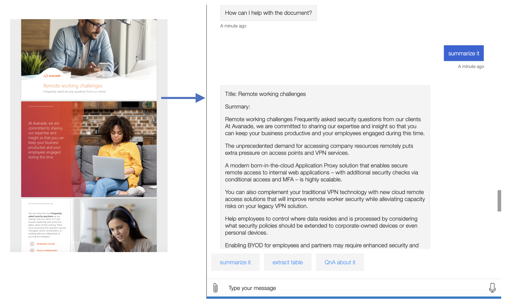

# COMP0016_2020_21_Team8 - AvaBot

## Overview

Project Title: Avanade2 COVID19 changes</br>
Team Member: Zihan Zhu, Chaozy Zhu, Davit Mirzoyan

## Project Intro

Due to the COVID-19 epidemic, most companies have switched to remote working, however, productivity and communication take a hit when employees are new to working from home.<br>
AvaBot is therefore created to ease the pain, it is a ChatBot assistant that holds rich knowledge base to answer employees' questions about the company's newly induced tools and policies for remote working.<br>
It is also endowed with AI functionalities, including natural language processing and image recognition, to help employees with documents: to read, analyze, and understand documents for them and thus enhance their productivity.

## System Architecture

AvaBot application system consists of several components. <br>
Users can interact with AvaBot as a REST API on web chat and on multiple applications to which it is channeled.<br>
The bot source code is deployed to Azure Cloud by using Azure Bot Service. The bot src can be found [./AvabotTeam8-src/](./AvabotTeam8-src).
<br>
AvaBot is connected to a QnA Maker with rich knowledge base that allows it to answer a variety of questions. The QnA Maker is configured in [./AvabotTeam8-src/dialogs/answerDialog.js](./AvabotTeam8-src/dialogs/answerDialog.js).<br>
Document processing functionalities are integrated to AvaBot by APIs. The code of the APIs are in [./textSum/](./textSum), [./QAsystem/](./QAsystem), and [./formRecogFunction/](./formRecogFunction). <br>
Due to the high complexity and dependency on environment, QA system has been placed to a virtual machine in order to optimize its performance.<br><br>
Below is the system architecture diagram for AvaBot:

<br><br>Below is the dialog flow diagram for AvaBot:


### <br><br>Project tree

Below is the project tree showing the main files and their uses in the repository:

```
.
├── AvabotTeam8-src/       # The bot source code
│   ├── .vscode            # VS Code configuration for bot development
│   ├── bots/
│       └── avabot.js      # The bot class
│   ├── coverage/          # Testing coverage report
│   └── dialogs/           # The bot's dialog classes
│       └── mainDialog.js
│       └── ...
│   ├── node_modules/      # Node module dependencies for the project
│   ├── PostDeployScripts/ # Bot Deployment Scripts for setting continuos deployment
│   ├── test/              # Unit tests and integration tests for the bot
│   ├── .env               # environment file for connecting to azure services
│   ├── index.js           # App entry point
│   ├── package.json       # Node.js package configuration file
│   ├── web.config         # Configuration file if using iisnode behind Express
│   └── ...
├── docs/                  # Documentation files
├── formRecogFunction/     # Src and documents for Form Recognizer API
├── QAsystem/              # Src and documents for QA system API
├── testAPI_example/       # Demo for calling APIs in python
├── textSum/               # Src and documents for Text Summarization API
├── WebBrowserBot/         # Demo for running AvaBot on a web browser
├── AvaBot.bot             # Bot configuration file for running the bot on MS bot emulator
├── LICENCE                # License for the project
└── *.md                   # Project documentation files
```

## Deployment

- See AvaBot Deployment Manual [here](./AvabotTeam8-src/README.md)
- See how to use the APIs for [Text Summarization](./textSum/README.md), [QA System](./QAsystem/README.md) and [Form Recognizer](./formRecogFunction/README.md)

## Usage

AvaBot is hosted on the Azure Bot Service. The service defines a REST API and an activity protocol for how bots and channels or users can interact. AvaBot's messaging endpoint is at `https://avabotteam8.azurewebsites.net/api/messages`.<br>
Demo for using the bot on a web browser can be found in [./WebBrowserBot/](./WebBrowserBot).

## ShowCase

### 1. AvaBot greets the user:<br><br>

<br>

### <br><br>2. AvaBot summarizes a document:<br><br>

<br>

### <br><br>3. AvaBot recognizes an image:<br><br>


## Appendix

- [Development Blog](https://chaozyhaha.wordpress.com/blog/)
- [Project Website](http://students.cs.ucl.ac.uk/2020/group8/index.html)
- [User Manual](http://students.cs.ucl.ac.uk/2020/group8/usermn.html)
